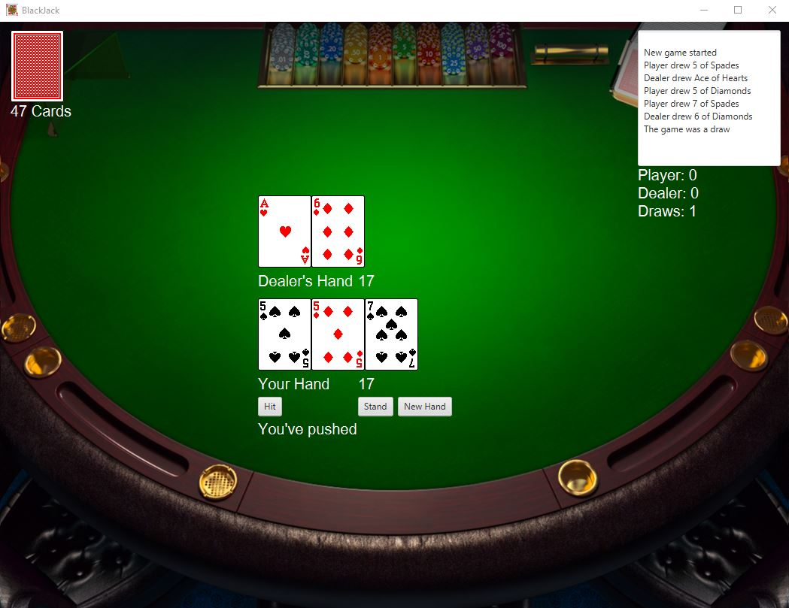

# Final Project: BlackJack

## Example Output

## Analysis Steps

After going through the requirements I decided the first thing I wanted to build was the deck of cards and attach the image for each card to them. After that I wanted to build the hands and start on the game logic, then worked on the design of everything once most of the game logic was in place.

## Design 

I used multiple classes and objects to make the project easier overall. The deck itself is an object, each card in it is an object, and the hands are objects. All the game logic and GUI designing is done in the main class. I wanted to show the deck to the user, as well as both hands in play and have an action log that told specifically what was going on in the game.

### Testing 

At first testing consisted of printing out the cards on a blank pane to see that the images were working and that it was being shuffled properly. Testing then became playing hand after hand of the game to see the game logic executing and ensuring it was all correct.
