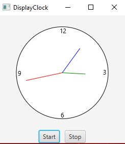

# Week05 Assign: Exercise 15.32 Control Clock

Use the clockpane object provided in the book and add animation to it so it acts like a functional clock

## Example Outout

## Analysis/Design Steps 

This one was very simple since the clock was already provided, all that had to be done was adding a timer to update the clock and give event listeners to the buttons

### Testing 

1. Ran the program for over a minute to make sure that when the second hand hit 12 the minute hand moved as well
