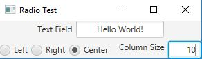

# Week06 Assign: Exercise 16.6 Demonstrate Text field properties

Use the various properties of the textfield object and also get some experience working with radio buttons

## Sample Output

## Analysis/Design Steps

Explore the properties of textfields and radiobuttons and apply some event handlers to modify those properties. I followed along with the video in the Revel textbook

## Testing

Not much was done since the code was provided in the textbook, however I did run it a few times while writing it to see how the layout was being constructed
