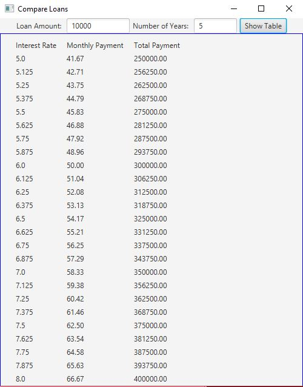

# Week07 Assign: Exercise 16.13 Compare loans with various interest rates 

Rewrite a program provided in the book in GUI format

## Example Output 

## Anaylsis/Design Steps

First I altered the user input to utilize the TextField objects so that the input can be read easily.
Then I changed parts of the loop to only use the information that was being presented to the user as shown in the example from the textbook.
Once everything was functional, the design of the table came into place by adding a row of data into an HBox and adding that HBox to a VBox and formatting the numbers to go to two decimal places.

### Testing 
Most of my testing was to get the layout of the table to be presented the way I wanted it to be, so running the program to make the alterations I saw fit was the summation of my testing.
