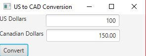

# USD to CAD Conversion

Create a GUI program that allows a user to enter a value in USD and convert that value into CAD.

## Example Output

## Analysis / Design

From reading the instructions I already had a full plan in mind. Set up the stage and then write the event listener and conversion method. I used HBoxs to create the two rows and added those along with the button to a VBox to stack the fields in the way I wanted.

### Testing

I didn't do much testing for this one as I already had to full plan in mind and knew how I wanted everything. The only thing that testing did bring to my attemtion was the disabled textfield greyed out the text inside so I changed that so that the value was easier to read.

