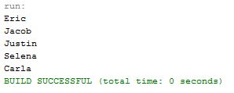

# Week09 Assign: Exercise 19.8 Shuffle ArrayList

Create an ArrayList and then shuffle it

## Example Output

## Analysis/Design

First the ArrayList had to be created, then the method to shuffle the ArrayList using a generic data type had to be done.

## Testing

The main part for testing was making sure the generic type wouldn't have any issues when the ArrayList is changed to a different data type and the shuffle method can still shuffle despite the data type of the array.
