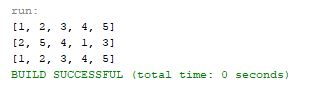

# Week09 Assign: Exercise 19.9 Sort ArrayList 

Write a method to sort an ArrayList.

## Example Output

## Analysis/Design

I used the shuffle() method from Week09 Shuffle ArrayList to shuffle the ArrayList so it can then be sorted. And printed the ArrayKist to the console after each step for both testing purposes and so you can see the sort() method actually sorting from minimun to maximum.

## Testing

I tested random sets of numbers along with just having numbers go in order for the sort() method to rearrange the ArrayList with.
