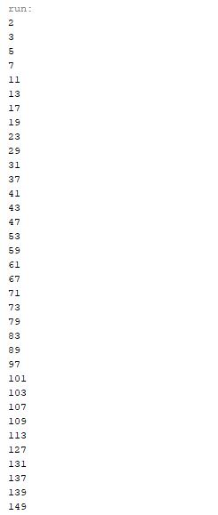

# Week10 Assign: Exercise 22.8 All prime numbers up to

## Example Output

## Analysis / Design

Write a program to find every prime number but to a certain point and all them all to a .dat file. I used a lot from the book to get what I needed to complete the program.

## Testing
To make sure the prime numbers were being found correctly I also had them print to the console so I could actively watch the new numbers be found and added to the file. This also let me make sure the program was correctly reading the most recent file entry and continuing from there.
