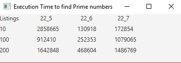

# Week10 Assign: Exercise 22.14 Execution time for prime numbers

## Example Output

## Analysis / Design

Use methods provided from the Revel textbook and time how long they each take to find all prime numbers up to designated limits. Since the methods from the book printed things out to the console, I left the console prints for the textbook methods because removing them caused errors and I'd have to rewrite each one to have them work without. However, I created a GUI window that will display a table for all the times of each method.

## Testing

At first I had one Label object that I planned to change the value of and then add it to each portion of the table that way, but in doing so I found that only one value would be given to the GUI display. To fix it, I created multiple Labels to prevent any sort of issues.
