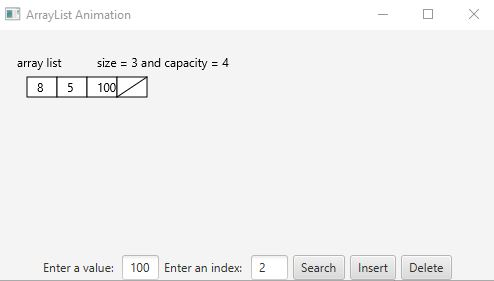

# Week11 Assign: Exercise 24.7 Animation: linked list 

Create a program that displays an animation showing what happens when using a linked list

## Example Output

## Analysis / Design

At first this assignment seemed like a LOT to get done, until I realized a lot of the code I needed was provided by the book. So by using pieces from the book and then adding the event listeners and everything to the stage.

### Testing

Going through the processes of inserting and searching and deleting items in the list to make sure that the animation was working properly and there were no logic errors.
