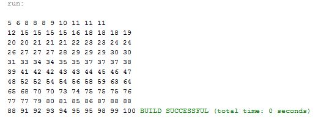

# Week11 Assign: Exercise 23.12 Radix Sort

## Example Output

## Analysis / Design

Write a Radix sort method and then generate random numbers into an array to be sorted by the Radix sort. I reffered to the textbook to write the Radix sort method and keyGen method that they used in their example. Then created an array to store random numbers to be ran through the Radix sort.

### Testing 

The book assignment says to generate 1,000,000 for times sake I cut that down to 100, so I can see all the numbers being created and easily tell if they are being sorted correctly.
