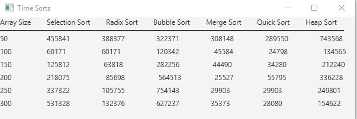

# Week12 Exam: Unit 3 Hands-On

Write a program that fills arrays with random values and then times how long different sorting methods take to sort them to compare their efficiency

## Example Output

## Analysis / Design

The first thing I knew to do was to use the sorting methods provided in the textbook along with the Radix sort I wrote in this program. Next it was creating the arrays and filling then and then designing the table. After that I wrote the timer methods to time how long it took each sorting method to complete the sort. Each sorting technique is in its own class and file, to keep the main file from being more cluttered than it already is.

### Testing

The main focus of my testing was for getting the table to look the way I wanted it to. I didn't want numbers being strewn all about the place. Also, using milliseconds to time the sorts resulted in sorts looking like they took the exact amout of time to compile, so I changed the time to nanoseconds to get more accurate data.
