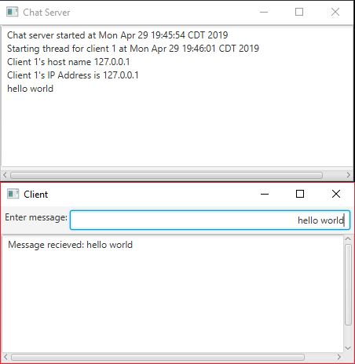

# Week14 Assign: Exercise 31.9 Chat

## Example Output

## Analysis / Design

Use the examples we did in class to build a server and a client and alter the client to allow for multiple connections from clients and allow the clients to send messages to one another. Each the client and the server are in their own file with a runnable main class and method. And I used inner classes to write the code for the server to handle multiple clients.

### Testing

I ran into several problems while testing. I wasn't able to restart the server correctly once it was closed down once, and had to restart the computer in order to run it properly again. I also was not able to figure out how to send the messages between clients. 
